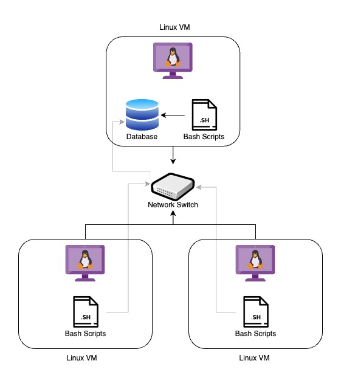

# Linux Cluster Monitoring Agent

## Table of Contents

- [Introduction](#Introduction)
- [Quick Start](#QuickStart)
- [Implementation](#Implementation)
- [Test](#Test)
- [Deployment](#Deployment)
- [Improvements](#Improvements)

## Introduction
A user-friendly solution developed by the Linux Cluster Administration (LCA) team to efficiently manage a cluster of 10 servers. It allows server users to monitor hardware and usage information easily, enabling the LCA team to ensure smooth operation and maintenance.

Implemented primarily with bash scripts, it integrates seamlessly with existing server management workflows. It provides users with valuable insights into server performance and health.

To ensure reliable data storage and management, PostgreSQL (psql) is chosen as the database technology, offering scalability and security for collected information. The project is implemented within a Docker container, enabling consistent execution across various server setups while minimizing compatibility issues.

Using Git version control, the development progress is well-tracked. By monitoring hardware and usage information, it empowers server users to optimize resource allocation and proactively address any issues. This comprehensive monitoring solution enhances the stability and efficiency of the server cluster, allowing for seamless operations.

## Quick Start
### 1. Clone the repo 
```shell script
# Clone the repo
git clone https://github.com/Jarvis-Consulting-Group/jarvis_data_eng-KunjPatel03.git
# Change directory to project
cd jarvis_data_eng_Kunj/linux_sql/
```
### 2. Create/Start/Stop a psql instance based on the 'postgres:9.6-alpine' image using psql_docker.sh
```shell script
# To create a psql instance with port number
bash ./scripts/psql_docker.sh create [db_username][db_password]
# To start a psql instance that is already created
bash ./scripts/psql_docker.sh start 
# To stop a psql instance that is already created
bash ./scripts/psql_docker.sh stop 
```

### 3. Create a Database named 'host_agent' that includes tables: 'host_info' and 'host_usage' using ddl.sql
```shell script
# Run ddl.sql scripts to create tables
psql -h localhost -U postgres -d host_agent -f ./sql/ddl.sql

```

### 4. Insert hardware specifications and usage data into the database host_ageny using host_info.sh and host_usage.sh
```shell script
# Insert hardware specifications into host_info table
bash ./script/host_info.sh host_agent_ip 5432 host_agent postgres password 
# Insert usage data into host_usage table using host_usage.sh 
bash ./script/host_usage.sh host_agent_ip 5432 host_agent postgres password
```

### 5. Setup Cron job
```shell script
# Crontab setup
crontab -e
# Add the cron job in cron job table to collect usage statistics every minute
* * * * * bash /home/centos/dev/jarvis_data_eng_Kunj/linux_sql/scripts/host_usage.sh localhost 5432 host_agent postgres password > /tmp/host_usage.log
```

## Implementation

To bring this project to life, we followed a systematic implementation process in a Linux environment running CentOS 7. The primary objective was to create a Minimum Viable Product (MVP) that would allow the LCA team to write SQL queries for future resource planning and management.

The implementation began with the installation of Docker, followed by the provisioning of a PostgreSQL (psql) instance and the installation of the psql CLI tool. These initial steps provided us the necessary foundations to proceed.

Next, we focused on creating a container to host the PostgreSQL database. Within this container, we meticulously designed a schema capable of efficiently storing hardware statistics. This ensured that the collected information would be well-organized and easily accessible for analysis and decision-making purposes.

To enable comprehensive monitoring of the Linux cluster, we developed two essential bash scripts: `host_info.sh` and `host_usage.sh`. The `host_info.sh` script was executed once during the installation process to retrieve and store hardware specifications in the PostgreSQL database. On the other hand, the `host_usage.sh` script was configured to execute every minute via a cron job, providing minute-to-minute monitoring of server usage. This granular monitoring data facilitated real-time insights into resource utilization patterns and performance trends.

Throughout the implementation process, we paid close attention to ensuring robustness, scalability, and efficiency. Regular testing and fine-tuning of the scripts were conducted to optimize their performance and reliability.

By adhering to this well-structured implementation approach, we successfully developed an efficient solution for monitoring hardware and usage information within the Linux cluster environment. The resulting application empowers the LCA team with valuable insights for proactive resource planning and effective maintenance of the server cluster.
### Architecture



### Scripts
- **psql_docker.sh**
  - The script creates a Docker container hosting a psql instance.
  - It requires the input of a username, password, and command to determine container actions.
  - The script checks the Docker container's status and performs appropriate actions, such as creating, starting, or stopping the container.
  
  ```shell script
  bash ./scripts/psql_docker.sh create [db_username][db_password]  
  ```

- **host_info.sh**
  - This script captures hardware information from the Linux host and inserts it into the PostgreSQL database.
  - It runs only once during installation to gather and store hardware specifications.
  
   ```shell script 
   bash ./scripts/host_info.sh
   ```

- **host_usage.sh**
  - This script collects server usage data and inserts it into the PostgreSQL database.
  - It is scheduled to run every minute using crontab, ensuring continuous monitoring of server usage.
  - The minute-to-minute server usage statistics are then updated and stored in the PostgreSQL database.
  
   ```shell script
   bash ./scripts/host_usage.sh
   ```

- **ddl.sql**
  - The ddl.sql script is used to create `host_info` and `host_usage` tables if not exist.
  
   ```shell script
   psql -h localhost -U postgres -d host_agent -f sql/ddl.sql
   ```


## Database Modeling

### host_info Table
#### The host_info table is used to store all the hardware specification data of VM.
| Column Name      | Data Type | Description                             |
|------------------|-----------|-----------------------------------------|
| id               | SERIAL    | Unique identifier for the host          |
| hostname         | VARCHAR   | Hostname of the machine                 |
| cpu_number       | INTEGER   | Number of CPUs in the host              |
| cpu_architecture | VARCHAR   | Architecture of the CPU                 |
| cpu_model        | VARCHAR   | Model information of the CPU            |
| cpu_mhz          | FLOAT     | Speed of the CPU in mHz                 |
| L2_cache         | INTEGER   | Size of the Level 2 cache in KB         |
| total_mem        | INTEGER   | Total memory in the host in KB          |
| timestamp        | TIMESTAMP | Timestamp of when the data was recorded |

### host_usage Table
#### The host_usage table is used to store usage data of VM.
| Column Name    | Data Type | Description                             |
|----------------|-----------|-----------------------------------------|
| timestamp      | TIMESTAMP | Timestamp of when the data was recorded |
| host_id        | INTEGER   | Foreign key referencing host_info table |
| memory_free    | INTEGER   | Free memory in the host in MB           |
| cpu_idle       | INTEGER   | Percentage of CPU idle time             |
| cpu_kernel     | INTEGER   | Percentage of CPU kernel time           |
| disk_io        | INTEGER   | Number of disk I/O operations           |
| disk_available | INTEGER   | Available disk space in MB              |

# Test
### Checking docker container is created successfully
```shell script
# Listing all the docker containers
docker container ls -a 
```
#### Result
| CONTAINER ID | IMAGE               | COMMAND                | CREATED    | STATUS                  | PORTS | NAMES     |
|--------------|---------------------|------------------------|------------|-------------------------|-------|-----------|
| 38b69ba520b5 | postgres:9.6-alpine | "docker-entrypoint.s…" | 7 days ago | Exited (0) 34 hours ago |       | jrvs-psql |

### Checking database host_agent is created successfully
```shell script
# Connecting to postgres database
psql -h localhost -U postgres - host_agent
# Listing all the databases
\l
```
#### Result
|    Name    |  Owner   | Encoding |  Collate   |   Ctype    | Access privileges |   
|------------|----------|----------|------------|------------|-------------------|
| host_agent | postgres | UTF8     | en_US.utf8 | en_US.utf8 |                   |   

### Checking hardware info is inserted in host_info table
```shell script
# Running the script
./script/host_info.sh localhost 5432 host_agent postgres password
# Connecting to host_agent database
psql -h localhost -U postgres - host_agent
# Selecting data from host_info table
SELECT * FROM HOST_INFO;
```
#### Result
| id |                            hostname                             | cpu_number | cpu_architecture |   cpu_model   | cpu_mhz  | l2_cache |      timestamp      | total_mem    |
|----|-----------------------------------------------------------------|------------|------------------|---------------|----------|----------|---------------------|--------------|
| 1  | jrvs-remote-desktop-centos7.us-east1-c.c.jarvis-389016.internal |          2 | x86_64           | AMD EPYC 7B12 | 2249.998 | 512K     | 2023-06-16 16:11:28 | 7817         |

### Checking usage data is inserted in host_usage table
``` 
# Running the script
./script/host_usage.sh localhost 5432 host_agent postgres password
# Connecting to host_agent database
psql -h localhost -U postgres - host_agent
# Selecting data from host_usage table
SELECT * FROM HOST_USAGE;
  
```
#### Result
| timestamp           | host_id | memory_free | cpu_idle | cpu_kernel | disk_io | disk_available |
|---------------------|---------|-------------|----------|------------|---------|----------------|
| 2023-06-19 13:15:32 | 1       | 2551        | 90       | 1          | 0       | 19230          |
| 2023-06-20 12:56:01 | 1       | 2137        | 83       | 2          | 0       | 19003          |
| 2023-06-20 12:57:01 | 1       | 2137        | 84       | 1          | 0       | 19002          |
| 2023-06-20 12:58:01 | 1       | 2133        | 85       | 1          | 0       | 19002          |
| 2023-06-20 12:59:01 | 1       | 2122        | 86       | 1          | 0       | 19002          | 
| 2023-06-20 13:00:01 | 1       | 2122        | 87       | 1          | 0       | 19002          |
| 2023-06-20 13:01:01 | 1       | 2121        | 87       | 1          | 0       | 19002          |
| 2023-06-20 13:02:01 | 1       | 2100        | 88       | 1          | 0       | 19002          |
| 2023-06-20 13:03:01 | 1       | 2095        | 89       | 1          | 0       | 19002          |
| 2023-06-20 13:04:01 | 1       | 2094        | 89       | 1          | 0       | 19002          |
| 2023-06-20 13:05:01 | 1       | 2093        | 89       | 1          | 0       | 19002          |

### Checking host_info and host_usage tables are created successfully

```shell script
# Running ddl.sql script
psql -h localhost -U postgres -d host_agent -f sql/ddl.sql
# Checking tables in host_agent database
\dt
```

#### Result
| Schema | Name       | Type  | Owner    |   
|--------|------------|-------|----------|
| public | host_info  | table | postgres |
| public | host_usage | table | postgres |

# Deployment
### Docker
- Install Docker on Linux Virtual Machine.
- Provision PostgreSQL instance using Docker.

### Git
- Utilize `psql_docker.sh`, `ddl.sql`, `host_usage.sh`, and `host_usage.sh` scripts from Github repository.

### PostgreSQL
- Create or start PostgreSQL container using `psql_docker.sh` script.
- Run `ddl.sql` script to create the host_info and host_usage tables in host_agent database.
- Use `host_info.sh` to insert hardware specification into the database.

### Crontab
- Use a cron job to execute `host_usage.sh` every minute to insert usage data into the database.

## Improvements
- User Interface Enhancement: Improve the user interface for better usability and visual appeal.
- Security Enhancements: Strengthen security measures to protect sensitive server information and ensure data integrity.
- Scalability and High Availability: Implement measures for scalability and high availability to accommodate growing workloads and ensure uninterrupted monitoring services.
