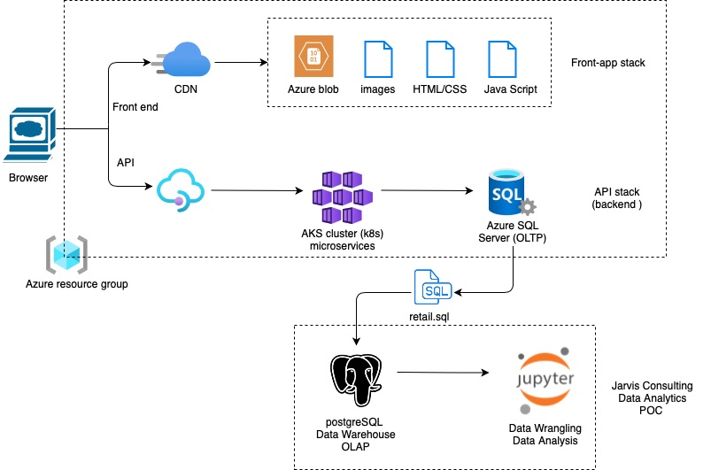

# Data Analytics Project

## Introduction

The London Gift Shop (LGS) is a well-established UK-based online store specializing in gift-ware. Despite its long-standing presence, the company has faced challenges in recent years with stagnant revenue growth. To address this, the LGS marketing team has embarked on a data-driven initiative to better understand customer behavior and develop effective sales and marketing techniques.

This data analytics project aims to analyze customer shopping behavior using the latest data technologies. By leveraging Python, Jupyter Notebook, Pandas, and Numpy, we have provided insights into customer segments, recency, frequency, and monetary value. The results can be utilized by the LGS marketing team to devise targeted marketing campaigns, attract new customers, and engage existing ones.

## Implementation

### Project Architecture

The project's architecture revolves around the integration of London Gift Shop's (LGS) web application and backend infrastructure, facilitating a seamless data analytics pipeline. Users engage with LGS's user-friendly web application front-end, where they browse, select products, and complete transactions. The back-end records and processes transactional data, ensuring accurate capture of customer interactions. This data is then structured into a dataset, often in the form of a script or CSV file, and seamlessly integrated into LGS's data warehouse. This data warehouse operates within a Docker container, providing a scalable and efficient environment for data storage and analysis. The containerized setup ensures easy deployment and management of the warehouse, enabling comprehensive data processing. This cohesive architecture harmoniously captures user interactions, records them, and integrates them into LGS's analytics pipeline. The data warehouse serves as a central hub for insightful analysis, empowering LGS to make informed decisions, optimize marketing strategies, and drive revenue growth.

### Data Analytics and Wrangling

We conducted thorough data analytics and wrangling to support LGS's revenue growth efforts. The details of the data analysis and wrangling process can be found in the [Retail Data Analytics and Wrangling Notebook](./retail_data_analytics_wrangling.ipynb). In this notebook, we performed the following key tasks:

- Calculated invoice amounts, summarized invoice statistics, and visualized the distribution of invoice amounts.
- Segmented customers based on Recency, Frequency, and Monetary Value (RFM) scores, allowing LGS to tailor marketing strategies to different customer segments.
- Analyzed monthly sales data and growth percentages, providing insights into revenue trends.
- Explored user activity and identified new/existing users, aiding LGS in understanding customer behavior over time.

## Improvements

While the initial data analysis has provided valuable insights, there are several areas for potential improvement:

1. **Predictive Modeling**: Develop predictive models to forecast customer behavior, enabling LGS to anticipate trends and plan strategies proactively.

2. **Personalized Recommendations**: Implement recommendation systems based on customer purchase history to provide personalized product suggestions, enhancing the shopping experience.

3. **Real-time Analytics**: Establish real-time analytics capabilities to monitor website traffic, customer engagement, and sales, facilitating agile decision-making.

These enhancements would further empower LGS to optimize its marketing efforts, enhance customer satisfaction, and achieve sustained revenue growth.