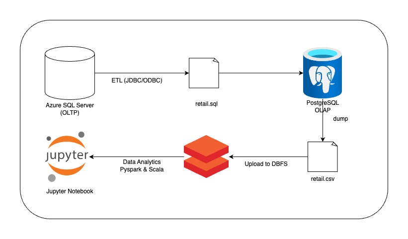
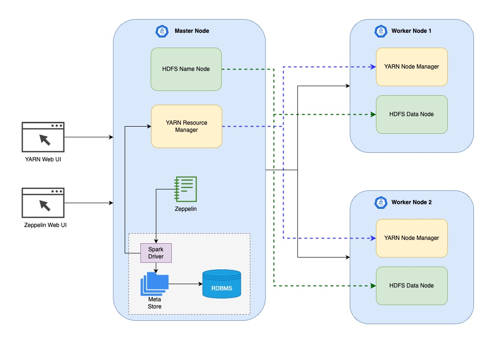

## Introduction

The London Gift Shop (LGS) is an established UK-based online store specializing in giftware. To address stagnant revenue growth, the LGS marketing team initiated a data-driven initiative to understand customer behavior and improve sales and marketing techniques. In a previous project, we successfully built a data analytics solution using Python, Jupyter Notebook, Pandas, and Numpy. This solution provided valuable customer insights and contributed to effective marketing campaigns.

In this project, we re-architect the data solution using Apache Spark, a framework that enables big data processing in a cluster. We also evaluate two Spark running environments, Databricks (on Azure) and Zeppelin (on Hadoop).

## Databricks and Hadoop Implementation

### Dataset and Analytics Work

We utilized a large dataset from LGS for our analytics work. The detailed analytics process can be found in the [Databricks Notebook](./notebook/Retail%20Data%20Analytics%20with%20PySpark.ipynb). In this notebook, we performed various tasks, including:

- Calculating Recency, Frequency, and Monetary Value (RFM) scores for each customer using PySpark structured APIs.
- Segmenting customers based on their RFM scores to tailor marketing strategies to different customer groups.
- Analyzing monthly sales data and calculating growth percentages to identify revenue trends.
- Exploring user activity and distinguishing between new and existing users to understand customer behavior over time.

### Architecture

Our architecture for the Databricks environment includes:
- Databricks workspace for notebook development.
- Databricks File System (DBFS) for data storage.
- PySpark and Scala for data processing.

## Zeppelin and Hadoop Implementation

### Dataset and Analytics Work

We also conducted analytics work in the Zeppelin environment with Hadoop. The analytics process is documented in the [Zeppelin Notebook](./notebook/Spark%20Dataframe%20-%20WDI%20Data%20Analytics.json). In this notebook, we performed similar tasks as in the Databricks environment.

### Architecture

Our architecture for the Zeppelin environment includes:
- Zeppelin notebook for analytics.
- Hadoop for distributed data processing.
- Hive Metastore for metadata management.
- PySpark for data analysis.
- Data flow to integrate data into the analytics pipeline.

## Future Improvements

While our current project provides valuable insights, we envision several future improvements:

1. **Predictive Modeling**: Develop predictive models to forecast customer behavior, enabling proactive planning.
2. **Personalized Recommendations**: Implement recommendation systems based on customer purchase history to enhance the shopping experience.
3. **Real-time Analytics**: Establish real-time analytics capabilities for agile decision-making and monitoring.

These enhancements will further empower LGS to optimize marketing efforts, enhance customer satisfaction, and achieve sustained revenue growth.